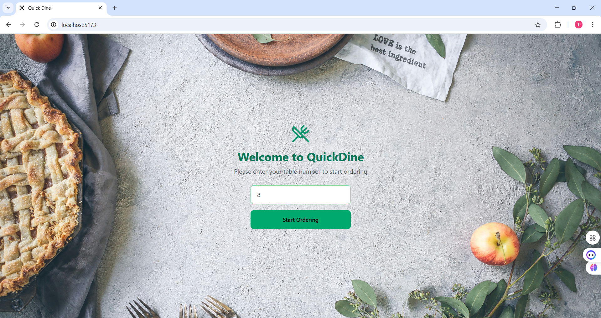
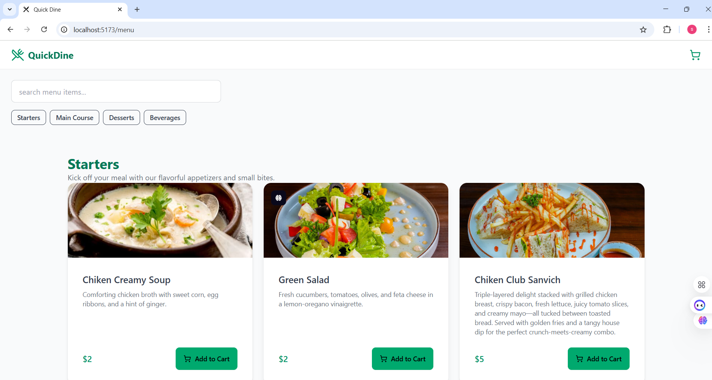
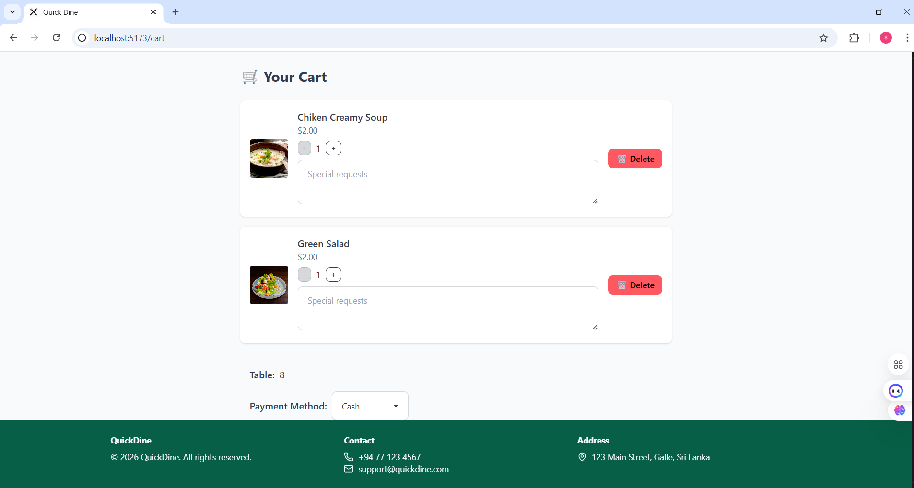
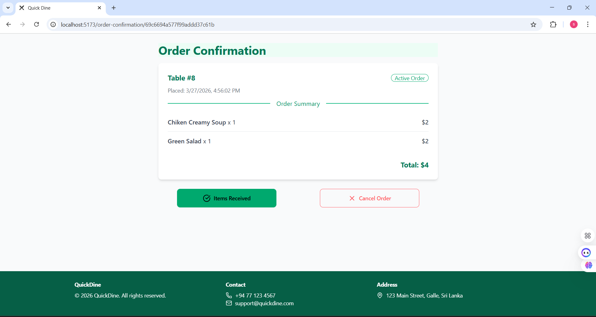
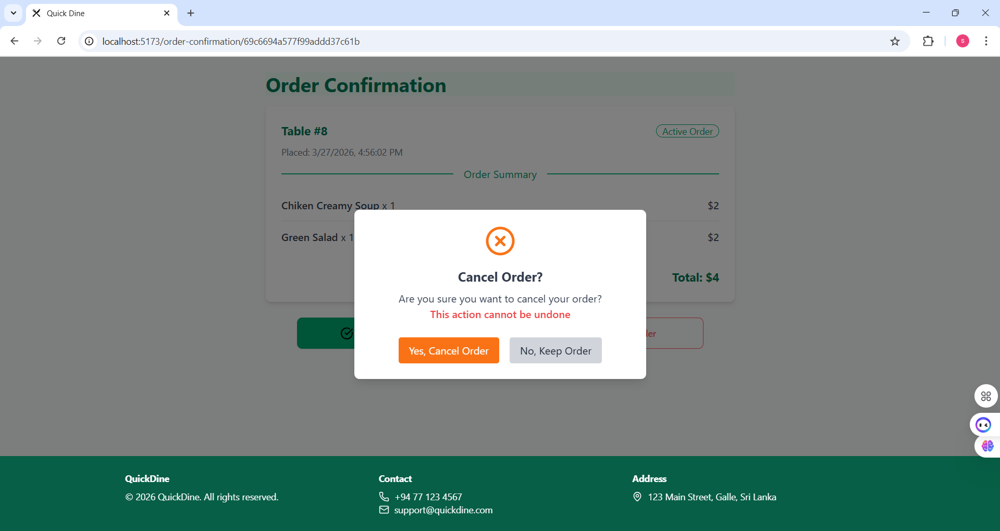
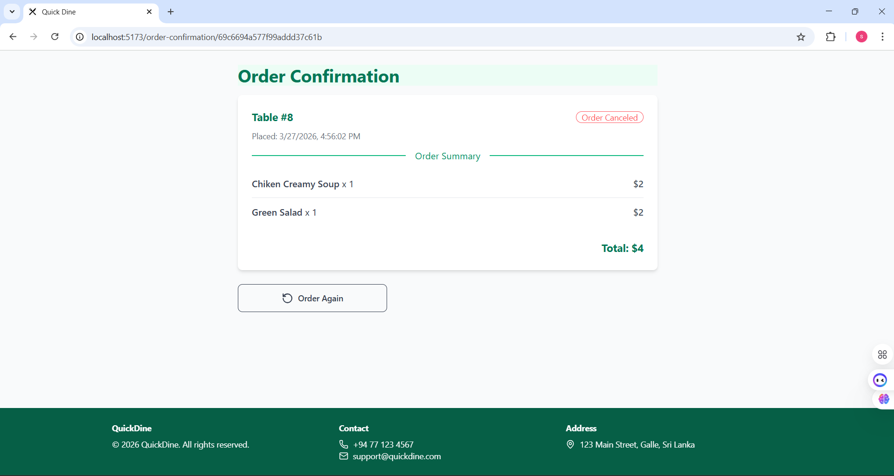

# 🍽️ QuickDine – Smart Restaurant Ordering System

QuickDine is a full-stack restaurant ordering system that allows customers to place orders by simply scanning a QR code at their table. The system eliminates the need for manual ordering and provides a seamless dining experience with real-time order management.

---

## 🚀 Features

- 📱 QR-based ordering system (no login required)
- 🍽️ Browse menu by categories (Main Course, Starters, Desserts)
- 🔍 Search functionality for menu items
- 🛒 Add items to cart and manage quantities
- ✅ Place orders directly from the table
- 🔄 Real-time order tracking
- 🧹 Automatic clearing of table data after order completion
- 👨‍🍳 Kitchen-side order management (future enhancement)

---

## 🏗️ System Architecture

QuickDine follows a **client-server architecture**:

- **Frontend:** React (Vite)  
- **Backend:** Node.js + Express  
- **Database:** MongoDB Atlas  
- **Communication:** REST APIs (HTTP)

---

## 🛠️ Tech Stack

### 🔹 Frontend
- React.js (Vite)
- Tailwind CSS
- DaisyUI
- Axios
- Lucide React (icons)

### 🔹 Backend
- Node.js
- Express.js

### 🔹 Database
- MongoDB Atlas

### 🔹 DevOps & Tools
- Docker & Docker Compose
- Jenkins (CI/CD)
- Terraform (Infrastructure as Code)
- AWS EC2 (Deployment)
- Git & GitHub

---

## ⚙️ Installation & Setup

### 1️⃣ Clone the Repository
```bash
git clone https://github.com/yourusername/quickdine.git
cd quickdine
```

---

### 2️⃣ Backend Setup
```bash
cd backend
npm install
npm start
```

Server will run on:
```
http://localhost:5000
```

---

### 3️⃣ Frontend Setup
```bash
cd frontend
npm install
npm run dev
```

Frontend will run on:
```
http://localhost:5173
```

---

## 🔗 API Overview

### 🧾 Orders
- `POST /orders` – Create a new order  
- `GET /orders` – Get all orders  
- `DELETE /orders/:tableId` – Clear table order  

### 🍔 Menu
- `GET /menu` – Get all menu items  

---

## 📸 Screenshots

### Home Page

### Menu Page

### Cart Page

### Order-Confirmation Page

### Cancel order

### Order again Page

```

---

## ☁️ Deployment

- 🚀 Deployed using AWS EC2  
- 🔄 CI/CD implemented with Jenkins  
- 📦 Containerized using Docker  

---

## 🌱 Future Improvements

- 👨‍🍳 Kitchen dashboard for order management  
- 🔔 Real-time notifications for order status  
- 💳 Online payment integration  
- 📱 Mobile application version  
- 📊 Admin analytics dashboard  

---

## 👨‍💻 Author

**Senuja Bodhinayake**

- 🔗 GitHub: https://github.com/senujaBodhinayake  

---

## 📌 Project Context

QuickDine was developed as a real-world restaurant automation system focusing on improving customer experience and operational efficiency. The system demonstrates full-stack development, DevOps practices, and scalable architecture design.

---

## ⭐ Support

If you like this project, give it a ⭐ on GitHub!

---

## 📬 Contact

- Email: senujabodhinayake123@gmail.com
